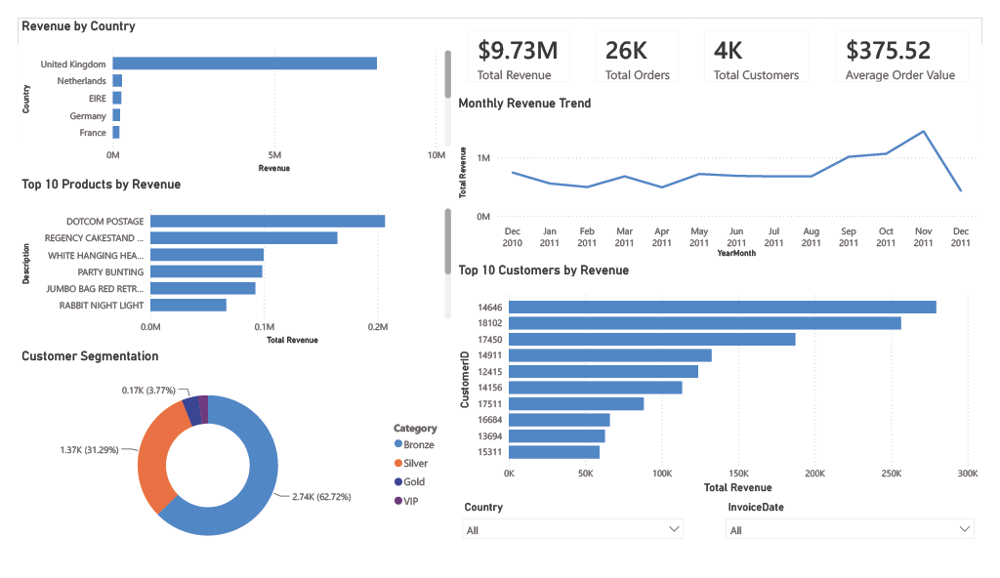

# Retail Customer Analytics

An end-to-end data analytics project that explores customer purchasing behaviour, product performance, and sales trends using SQL, Python, and Power BI.

The project demonstrates a complete analytics workflow, including data cleaning, SQL analysis, exploratory data analysis, business insights, and an interactive Power BI dashboard.

---

## Project Overview

The objective of this project is to analyze retail transaction data to answer business questions such as:

- Which countries generate the highest revenue?
- Who are the most valuable customers?
- Which products contribute the most revenue?
- How does revenue change over time?
- How are customers distributed across spending categories?

The project combines SQL for querying data, Python for analysis and visualization, and Power BI for interactive dashboard creation.

---

## Dataset

**Source:** Online Retail Dataset (UCI Machine Learning Repository)

The dataset contains transactional records from an online retail business.

Key columns include:

- Invoice Number
- Invoice Date
- Customer ID
- Product Description
- Quantity
- Unit Price
- Country

After cleaning, an additional **Revenue** column was created.

---

## Tools & Technologies

- SQL (PostgreSQL)
- Python
- Pandas
- Matplotlib
- Jupyter Notebook
- Power BI
- Git & GitHub

---

## Project Structure

```text
Retail-Customer-Analytics/
│
├── dashboard/
│   ├── Retail_Customer_Analytics.pbix
│   └── Retail_Customer_Analytics.pdf
│
├── data/
│   ├── raw/
│   └── processed/
│
├── notebooks/
│
├── sql/
│   ├── 01_schema.sql
│   ├── 02_import_data.sql
│   ├── 03_basic_queries.sql
│   ├── 04_group_by_queries.sql
│   ├── 05_case_queries.sql
│   ├── 06_joins_queries.sql
│   ├── 07_subqueries.sql
│   ├── 08_cte_queries.sql
│   ├── 09_window_functions.sql
│   └── 10_business_analysis.sql
│
├── images/
│
├── README.md
└── requirements.txt
```

---

## SQL Analysis

The SQL section demonstrates:

- Database creation
- Data import
- Basic SQL queries
- GROUP BY analysis
- CASE statements
- JOINs
- Subqueries
- Common Table Expressions (CTEs)
- Window Functions
- Business-focused analytical queries

---

## Python Analysis

Python was used for:

- Data exploration
- Revenue analysis
- Customer analysis
- Product analysis
- Customer segmentation
- Monthly revenue trends
- Data visualization using Matplotlib

---

## Power BI Dashboard

The interactive dashboard includes:

- Total Revenue KPI
- Total Orders
- Total Customers
- Average Order Value
- Revenue by Country
- Monthly Revenue Trend
- Top Products by Revenue
- Top Customers by Revenue
- Customer Segmentation
- Interactive Country Filter
- Interactive Date Filter

---

## Key Business Insights

- The United Kingdom generates the highest revenue.
- Revenue is concentrated among a relatively small number of customers.
- High-selling products are not always the highest revenue-generating products.
- Most customers belong to the Bronze spending category.
- Revenue varies throughout the year, indicating seasonal purchasing patterns.

---

## Dashboard Preview

Below is the interactive Power BI dashboard created as part of this project.



---

## How to Run

1. Clone the repository

```bash
git clone https://github.com/imakarshv/Retail-Customer-Analytics.git
```

2. Install dependencies

```bash
pip install -r requirements.txt
```

3. Open

- Jupyter Notebook for Python analysis
- SQL scripts in PostgreSQL
- Power BI dashboard (.pbix)

---

## Skills Demonstrated

- SQL
- Data Cleaning
- Data Analysis
- Exploratory Data Analysis
- Data Visualization
- Business Intelligence
- Power BI
- Python
- Pandas
- Git
- GitHub

---

## Author

Akarsh Vuttaradi

LinkedIn: linkedin.com/in/akarsh-vuttaradi

GitHub: https://github.com/imakarshv
